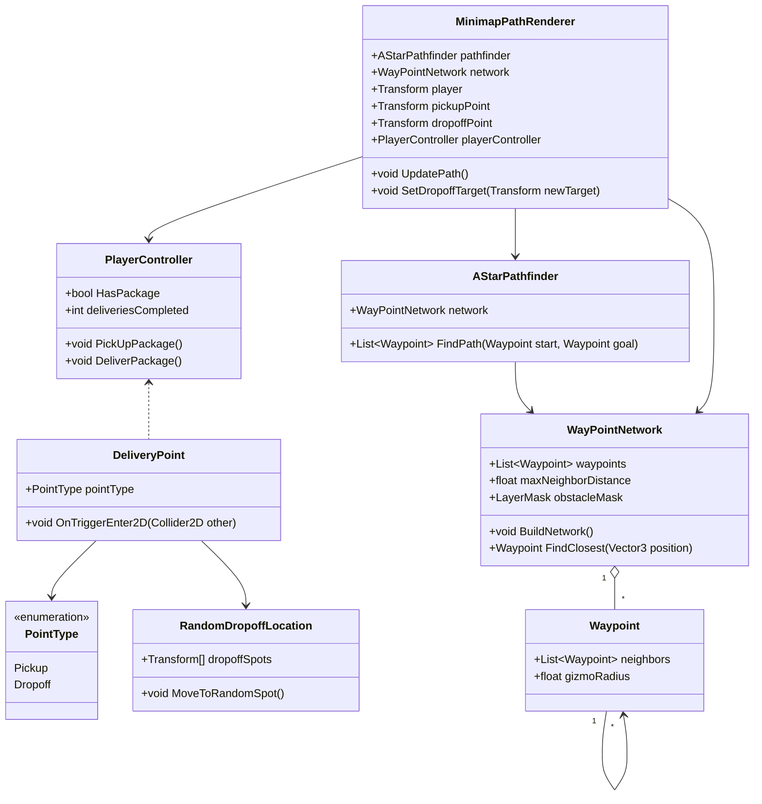

# RoadRunner Delivery 🚴‍♂️📦

A simple 2D delivery game made in Unity.

You play as a courier in a small city:
- Pick up food orders from a restaurant
- Deliver them to random buildings around the map
- Follow the route shown on the minimap
- The path updates automatically after each delivery

Buildings and sidewalks are blocked, so you must stay on the roads.
The goal is to complete as many deliveries as possible.

## How to Play
- Move with WASD / Arrow keys
- Walk into the pickup point to get a package
- Follow the minimap line to the delivery point
- A new destination appears after each delivery

## Play Online
The game is also available on itch.io:

➡️ **[Play Here]((https://alpha444rt.itch.io/roadrunnerdeliveryv2))**

## Run Locally
1. Clone the repo
2. Open in Unity
3. Run the `Main` scene

## UML – Class Diagram

